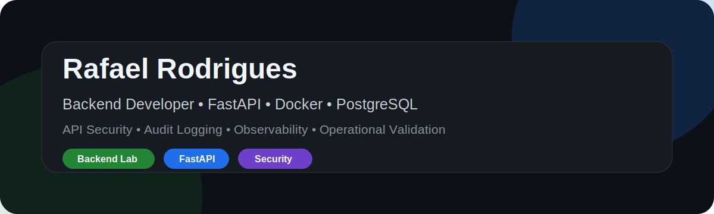

<!-- PROFILE_TOP_V2 -->

# Rafael Rodrigues

### Backend Lab Portfolio

Python • FastAPI • Docker • PostgreSQL • API Security • Observability

Last updated: 2026-05-21 16:05

---

  

# Rafael Rodrigues

**Backend Developer** focused on **Python**, **FastAPI**, **Docker**, **PostgreSQL**, **API Security** and **Observability**.

I build backend projects with emphasis on clean architecture, reproducible local environments, authentication flows, auditability and operational validation.

  
  
  
  
  
  

## Main Focus

- Backend API development with FastAPI
- Docker based development environments
- PostgreSQL and SQLAlchemy
- JWT authentication and protected routes
- Audit logging and security minded development
- Health checks and operational validation
- Clean documentation for reproducible projects

## Featured Project

### [FastAPI Platform Lab](https://github.com/rafael-backend-lab/fastapi-platform-lab)

Professional backend laboratory project built with FastAPI, PostgreSQL, Docker, JWT authentication, admin routes, notes management, audit logging and automated health tests.

## Technical Stack

| Area | Tools |
|---|---|
| Backend | Python, FastAPI |
| Database | PostgreSQL, SQLAlchemy |
| Containers | Docker, Docker Compose |
| Security | JWT, protected routes, audit logs |
| Testing | Pytest, health checks |
| Workflow | Git, GitHub, VS Code, terminal first workflow |

## Engineering Principles

- Understand the system before changing it
- Keep changes small, clear and reversible
- Prefer reproducible local setup
- Validate before delivery
- Document decisions and operational steps
- Treat security and auditability as part of backend design

## Public Portfolio

| Repository | Purpose |
|---|---|
| [fastapi-platform-lab](https://github.com/rafael-backend-lab/fastapi-platform-lab) | Main backend portfolio project with FastAPI, PostgreSQL, Docker, JWT and audit logging |

## Profile Status

Professional GitHub profile focused on backend development, platform engineering foundations and practical software delivery.
